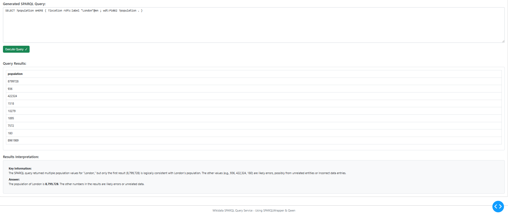

# SPARQL Wikidata Query Tool

A simple Python tool for querying Wikidata using SPARQL.

## Prerequisites

- Python 3.8 or higher
- pip (Python package installer)

### For Docker Usage

- [Docker](https://www.docker.com/get-started) (version 19.03.0 or higher)
- [Docker Compose](https://docs.docker.com/compose/install/) (version 1.25.0 or higher)
- At least 2GB of RAM available for Docker
- Internet connection (for downloading Docker images and querying Wikidata)

### For LLM Model Usage

- Sufficient disk space and RAM for model weights (varies by model, typically 4GB+ RAM and 4GB+ disk)
- If using GPU acceleration: CUDA-compatible GPU and drivers installed
- Downloaded LLM model files (see project documentation or model provider for details)
- Set environment variables or configuration files to point to the model location if required

## Installation

1. Clone or download this repository:
   ```bash
   git clone https://github.com/adrianB1996/sparql_wikidata.git
   cd sparql_wikidata
   ```
2. Move into the solution folder in your local solution (if not already there):
   ```bash
   cd solution
   ```

3. Install required dependencies:
   ```bash
   pip install -r requirements.txt
   ```

## Running the Script

To run the Wikidata query tool:

```bash
python query_wikidata.py
```
## Running with Docker

1. Ensure Docker and Docker Compose are installed and running.
2. Build and start the service:
   ```bash
   docker compose build --no-cache
   ```
3. To run just the main script in a container for the interview question (You may need to run it twice if the container is warming up :):
   ```bash
   docker compose run --rm dash-app python query_wikidata.py
   ```

4. To run the frontend and backend. This will take awhile as the models and manifests will need to be pulled through:
   ```bash
   docker compose up
   ```

5. To stop the service:
   ```bash
   docker compose down
   ```

## Viewing the Frontend

- Open your browser and go to: [http://localhost:8050](http://localhost:8050)
- If you changed the port in your Docker or application configuration, use that port instead.
- You can try out the preselected options or you can try the SPARQL query generator. It can answer about other people or places. (It's very rough)
- Write in a simple question
- click generate sparQL --> This will generate a query and check it's formatted correctly. 
- get results and interpret. 
- I just wanted to see what I could do with a tiny model. 
- It can take a little while to interpret the result and respond. 



